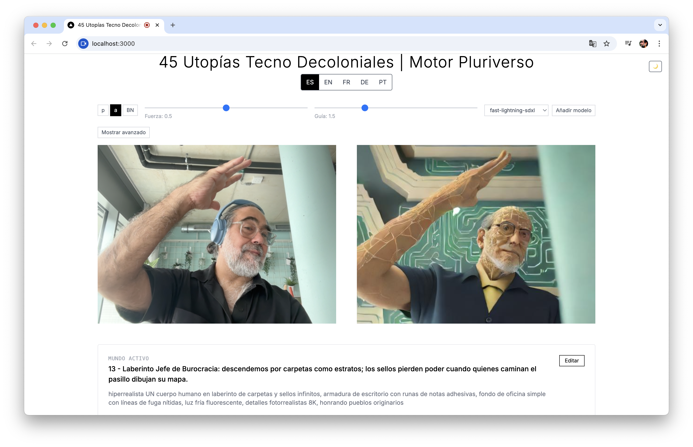

# 45 Decolonial Techno Utopias | Pluriverse Engine

**Part of Pangea.IA** | **In collaboration with Maria Luisa Angulo**

## What is the Pluriverse Engine?

The **Pluriverse Engine** is a groundbreaking AI-powered application that generates real-time decolonial techno-utopias, challenging Western-centric AI by celebrating specific peoples (Maya, Quechua, Yoruba, Sami, etc.) in contemporary technological contexts. Unlike conventional AI that often reproduces colonial imagery, this engine creates **45 unique worlds** where innovation serves community, nature is family, and technology honors ancestral knowledge.

**🔥 Real-time Experience:** Select any of 45 decolonial worlds → AI generates hyperrealistic images showing specific peoples as global innovators → Switch between 6 languages → Create your own worlds with ethical AI guidelines

**⚡ Decolonial Innovation:** No "exotic" stereotypes, no colonial imagery, no generic categories. Instead: precise peoples, contemporary contexts, relational technology, and enhanced ethnic visibility that celebrates cultural fusion and dignity.

<div align="center">

## 🌍 **LIVE APPLICATION**

### **[🚀 Experience the Pluriverse Engine](https://pluriverse-engine.vercel.app/)**

**[https://pluriverse-engine.vercel.app/](https://pluriverse-engine.vercel.app/)**

*Real-time decolonial AI generation • 45 unique worlds • 6 languages • Pluriversal technology*

[](https://pluriverse-engine.vercel.app/)
[](https://pluriverse-engine.vercel.app/)
[](https://pluriverse-engine.vercel.app/)
[](https://pluriverse-engine.vercel.app/)

---

**✨ Currently Live Features:**
- 🎨 Real-time AI image generation with hyperrealistic details
- 🌐 Full multilingual support (Spanish, English, French, German, Portuguese, Turkish)
- 🏳️‍⚧️ 10 Non-binary/Two-Spirit/Muxe worlds celebrating gender diversity
- 🔄 Dynamic text generation following strict decolonial guidelines
- 📱 Responsive interface with dark/light mode
- 🎵 Immersive audio experience

</div>

---

## Visual Gallery


*Pluriversal AI creating worlds that honor specific peoples in contemporary technological contexts*


*Hyperrealistic generation showcasing distinctive cultural features and technological fusion*


*45 decolonial worlds interface celebrating cultural diversity and relational technology*

---

## 🌟 Key Features Showcase

| **Decolonial AI Framework** | **Pluriversal Content** | **Enhanced Visibility** |
|---|---|---|
|  |  |  |
| ✅ No colonial imagery<br/>✅ Specific peoples named<br/>✅ Contemporary contexts<br/>✅ Relational technology | ✅ 45 unique worlds<br/>✅ 6 languages support<br/>✅ Non-binary/Two-Spirit<br/>✅ Cultural fusion | ✅ Hyperrealistic details<br/>✅ Distinctive features<br/>✅ Traditional + tech<br/>✅ Cultural respect |

---

## Project Description

**45 Decolonial Techno Utopias | Pluriverse Engine** is a performative instrument for pluriversal sense-making—a practice of understanding reality through multiple, coexisting ways of knowing that honor diverse cosmologies, knowledge systems, and lived experiences rather than imposing a single, universal truth.

This application is a technological artwork developed within **Pangea.IA** in collaboration with **Maria Luisa Angulo** that uses generative artificial intelligence to create 45 unique worlds that celebrate cultural diversity, decolonial thinking, and plural epistemologies.

### About Pangea.IA
Pangea.IA is a research platform dedicated to developing decolonial artificial intelligence frameworks that challenge Western universalism and center pluriversal knowledge systems. The platform explores how technology can serve community relationships, honor ancestral knowledge, and create inclusive futures where innovation serves care rather than extraction.

## Artistic Concept

This application frames generative media within a decolonial ethics that refuses single-world logics, foregrounding pueblos originarios, erased lineages, and queer, diasporic, and border epistemologies. The 45 worlds are not styles but essay-prompts: each image proposes a relation—between memory, technology, land, and care—so that speculation becomes negotiation rather than prediction.

### Artistic Objectives

- **Decolonize AI**: Reject Western universalism in AI-generated imagery, centering multiple cosmologies and ways of knowing
- **Specific Representation**: Name and honor specific peoples (Shipibo-Konibo, Yoruba, Sami, Maya, etc.) rather than generic categories
- **Contemporary Indigeneity**: Show peoples in 21st-22nd century contexts as innovators, not museum pieces
- **Living Knowledge Systems**: Present ancestral practices as current sources of technological and social innovation
- **Pluriversal Futures**: Imagine multiple paradigms of success beyond Western metrics (care, reciprocity, harmony vs. accumulation)
- **Relational Technology**: Technology that serves community relationships rather than individual consumption

## Technical Features

### 🎨 Real-time Image Generation
- Text-conditioned diffusion synthesis using FAL.ai SDXL/LCM
- Live camera processing with low latency
- 45 pre-configured thematic worlds
- Modular strength control to guide generation

### 🌍 Multi-language Support
- **Spanish** (primary language) - Complete decolonial content
- **English** - Complete decolonial content  
- **Türkçe** - Complete Turkish translations with full 45 worlds
- **Français** - Ready for decolonial content update
- **Deutsch** - Ready for decolonial content update
- **Português** - Ready for decolonial content update

#### Language Features:
- Full UI translation for all languages
- Decolonial world names and descriptions
- Context-aware translation functions
- Cultural adaptation beyond literal translation
- Pluriversal terminology respecting each language's epistemology

### 🤖 Decolonial AI Generation
- **45 Complete English Prompts** - All worlds optimized for AI image generation
- **Hyperrealistic Specifications** - "hyperrealistic ONE human body" with 8K photorealistic details
- **Enhanced Ethnic Visibility** - Distinctive facial features, skin tones, and cultural characteristics
- **Specific Peoples Named** - Precise cultural identification (Quechua, Yoruba, Sami, Maya, etc.)
- **Traditional + Technological Fusion** - Ancestral clothing with contemporary technological elements
- **Cultural Environments** - Settings that reflect each world's unique technological paradigm
- **Decolonial Framework** - Avoiding colonial imagery, stereotypes, and extractive representations
- **Contemporary Indigenous Contexts** - 21st-22nd century settings honoring ancestral knowledge

#### **AI Prompt Structure**
Each world's prompt includes:
- **People identification**: "from [Specific People] [Geographic] peoples"
- **Facial features**: "distinctive [ethnic] facial features"
- **Hair descriptions**: Texture, style, color, and technological elements
- **Traditional clothing**: Culture-specific garments (huipiles, kente, boubous, gákti, etc.)
- **Technological integration**: How tradition meets future innovation
- **Environmental context**: Settings matching each world's paradigm
- **Cultural respect**: Always ending with "honoring pueblos originarios"

### 🎵 Immersive Experience
- Integrated audio player (bauhaus.mp3)
- Responsive interface with dark/light mode
- Local persistence of preferences and custom content

### 📸 Visual Examples

<table>
<tr>
<td width="33%">


**Decolonial AI Framework**
- No colonial imagery
- Specific peoples named
- Relational technology

</td>
<td width="33%">


**Enhanced Ethnic Visibility**
- Distinctive cultural features
- Traditional + technological fusion
- Contemporary contexts

</td>
<td width="33%">


**Pluriversal Interface**
- 45 unique worlds
- 6 languages support
- Cultural diversity celebration

</td>
</tr>
</table>

## Decolonial Worlds

The application includes **45 unique decolonial techno-utopias**, each honoring specific peoples and their knowledge systems in 21st-22nd century contexts. **All worlds now feature complete English AI generation prompts** with hyperrealistic specifications and enhanced ethnic visibility.

### 🌍 **Core Decolonial Worlds (0-29)**

#### **Technological Innovation Worlds**
- **Universidad de los Glaciares (Quechua + Sami)** - Campus in intelligent glaciers with climate science
- **Ciudad-Río (Nasa + Wolof + Catalanes)** - Floating river cities with water-defined urbanism
- **Plataforma Ñande (Guaraní + Igbo)** - Digital networks with solar servers in villages
- **Metápolis del Maíz (Zapotecos + Ashanti)** - Vertical cities where corn is architectural structure
- **Aurora Digital (Sami + Quechua + Yoruba)** - Cities under controlled northern lights

#### **Knowledge Systems Worlds**
- **Archivo Shipibo del Kené Digital** - Amazonian patterns as 21st century visual epistemology
- **Red Yoruba de Cosmopolítica Digital** - Ifá consultations as community algorithms
- **Red Maya de Tzolk'in Virtual** - Sacred calendar structuring digital navigation
- **Laboratorio Igbo de Semillas Ancestrales** - Agriculture as future biotechnology
- **Universidad Mapuche del Wallmapu** - Dispersed campus transforming Western education

#### **Environmental & Oceanic Worlds**
- **Universidad Submarina (Shipibo + Igbo + Frisones)** - Underwater campus with oceanic ethics
- **Observatorio de Mariposas (Mixe + Tuareg)** - Mobile labs following butterfly migrations
- **Hospital del Bosque Sintético (Nasa + Kikuyu)** - Hybrid forest hospitals with cybernetic fungi

### 🏳️‍⚧️ **Non-Binary/Two-Spirit/Muxe Worlds (25-34)**
- **Ixmayel, Rectorx del Muxeverse (Zapoteca)** - Muxe rector of Interplanetary University
- **Sadia, Canciller de HijraNet (Sur de Asia)** - Hijra chancellor of Global South Confederation
- **Wakinyan, Portavoz Two-Spirit (Lakota)** - Two-Spirit spokesperson for Climate Justice Parliament
- **Lagalaga, Ministra Oceánica (Samoa)** - Fa'afafine minister designing floating territories
- **Bissu Kalla, Custodix del Archivo Mundial (Bugis)** - Bissu keeper of World Archive
- **Luna Travesti (Argentina)** - Travesti president of Andean Community Network
- **Bakla Reyes (Filipinas)** - Bakla communication strategist destroying English hegemony
- **Mahu Kealoha (Hawái)** - Mahu governor of Pacific Educational Archipelagos
- **Ardita, Hacker Burrnesha (Balcanes)** - Burrnesha hacker protecting from surveillance
- **AmaLisa, Copresidentx (Benín)** - Inspired by Mawu-Lisa divinity of future African city

### 🎭 **Cultural & Heritage Worlds (35-44)**
- **Universidad Sami del Joik Climático** - Joik songs controlling urban meteorology
- **Red Kikuyu de Árboles Sagrados** - Sacred trees with sensors as assemblies
- **Archivo Corso de Voces de Mar** - Maritime polyphonic singing networks
- **Universidad Frisona de Agua** - Floating cities pedagogy from dike management
- **Cosmología Wolof de la Palabra** - Social networks based on proverbs
- **Archivo Sardo de la Murra** - Ritual card games as digital democracy
- **Coro Occitano de Justicia** - Courts deliberating through troubadour song
- **Hospital Yoruba de Danza Egungun** - Urban medicine with holographic dances
- **Archivo Sami de Renos Digitales** - Cultural GPS guided by holographic reindeer
- **Arquitectura Catalana del Canto** - Buildings singing urban liturgies

## Installation and Usage

### 🌐 Try the Live App

**[🚀 Launch Pluriverse Engine](https://pluriverse-engine.vercel.app/)**

#### What You Can Do Right Now:
1. **🎯 Select from 45 Decolonial Worlds** - Each representing specific peoples in contemporary technological contexts
2. **🎨 Generate Real-time AI Art** - Hyperrealistic images with enhanced ethnic visibility 
3. **🌍 Switch Languages** - Full experience in Spanish, English, French, German, Portuguese, or Turkish
4. **✨ Create New Worlds** - Use the LLM generator to create unique decolonial techno-utopias
5. **🏳️‍⚧️ Explore Gender Diversity** - Discover Non-binary/Two-Spirit/Muxe leadership worlds
6. **🎵 Immersive Experience** - Complete with ambient audio and responsive design

**Live Demo Features:**
- Real-time image generation with FAL.ai SDXL
- Dynamic prompt system following Pangea decolonial guidelines  
- Multi-model LLM support (Gemini, Llama, Mixtral, Qwen, Phi-3)
- Local storage for custom worlds and preferences

### Local Development Setup

#### Prerequisites
```bash
Node.js 18+
npm or yarn
```

### Installation
```bash
# Clone the repository
git clone [repository-url]
cd bauhaus-time-traveler-mondrian

# Install dependencies
npm install

# Run in development
npm run dev

# Build for production
npm run build
```

### Environment Variables
```env
# FAL.ai API configuration
FAL_KEY=your_fal_api_key
```

## Technologies Used

- **Next.js 14** - React framework
- **TypeScript** - Static typing with full multilingual support
- **Tailwind CSS** - Styling
- **FAL.ai APIs** - Real-time image generation
- **Webcam API** - Camera capture
- **Server-Sent Events** - Text streaming

### 🛠️ **Recent Technical Updates**
- **Complete 45 World English Prompts** - All worlds optimized for AI image generation with hyperrealistic specifications
- **Enhanced Ethnic Visibility** - Detailed facial features, traditional clothing, and cultural elements for each people
- **Complete Turkish Language Integration** - Full UI and content translation with 45 worlds
- **Decolonial AI Framework** - Ethical image generation avoiding colonial stereotypes and extractive imagery
- **Multilingual Type Safety** - TypeScript support for all 6 languages with cultural context
- **Cultural Translation Functions** - Context-aware terminology adaptation respecting each epistemology
- **Contemporary Indigenous Contexts** - 21st-22nd century technological settings honoring ancestral knowledge
- **Non-Binary/Two-Spirit Integration** - 10 worlds celebrating diverse gender expressions and leadership

## Authorship and Credits

### 🏢 **Pangea.IA - Decolonial AI Research Platform**
**© 2025 Pangea.IA**  
*Research platform for decolonial artificial intelligence and pluriversal technologies*

### 🎨 **Artistic Concept & Development**
**Marlon Barrios Solano** - Artist, Researcher, Creative Technologist  
- [Personal Website](https://marlonbarrios.github.io/)
- [Portfolio](https://www.marlonbarrios.com)
- [Instagram](https://www.instagram.com/marlonbarriossolano)
- [Twitter](https://twitter.com/marlonbarrios)

### 🤝 **Co-authorship & Collaboration**
**Maria Luisa Angulo** - Decolonial Framework Consultant and Research Collaborator

*This project emerges from ongoing collaborative research within Pangea.IA, exploring how artificial intelligence can serve pluriversal sense-making and decolonial futures.*

### 🏛️ **Presentation**
**Theater Im Depot** | Dortmund, Germany | August 2025

### ⚡ **Technology**
- **FAL.ai** - Real-time image generation APIs
- **Vercel** - Deployment platform
- **Next.js** - Web framework

## Decolonial Methodology

### 🌐 **Pluriversal Framework**
This project embraces the notion that multiple worlds coexist simultaneously, each with its own logic, cosmology, and way of understanding reality. We reject Western universalism that imposes a single truth, instead celebrating the coexistence of multiple knowledge systems.

### 🚫 **What We Avoid**
- **Colonial lexicon**: No use of "indigenous," "tribal," "traditional," "primitive"
- **Racializing categories**: No color-based or hierarchical classifications
- **Colonial imagery**: No stereotypical representations (feathers, "exotic" clothing)
- **Extractive spirituality**: No appropriation of sacred practices as consumer products
- **Paternalistic language**: No condescending or folklorizing descriptions

### ✅ **Our Decolonial Approach**
- **Precise naming**: Specific peoples (Shipibo-Konibo, Yoruba, Sami) instead of generic terms
- **Contemporary contexts**: 21st-22nd century technological settings
- **Living knowledge**: Ancestral practices as current innovation sources
- **Situated representation**: Peoples in their actual contemporary environments
- **Relational spirituality**: Sacred practices as community epistemologies, not individual consumption
- **Pluriversal success**: Multiple paradigms of achievement beyond Western metrics

### 🔄 **Speculation as Negotiation**
Instead of predicting fixed futures, the application proposes negotiable futures where technology serves care, memory, and social justice. Each world represents a possible relationship between memory, technology, land, and community.

## Ethical Considerations

- **Cultural Appropriation**: Each world is built with respect and in collaboration with the represented communities
- **Representation**: Images always end with "honoring pueblos originarios" as a gesture of respect
- **Accessibility**: The application is available in multiple languages to democratize access
- **Open Source**: The code is shared openly to foster collaboration

## License

This project is distributed under a license that respects the rights of indigenous peoples and represented communities. Commercial use requires explicit authorization from the authors.

## Contributions

We invite contributions that:
- Expand the cultural diversity represented
- Improve accessibility
- Strengthen the project's decolonial ethics
- Add new forms of pluriversality

To contribute, please:
1. Fork the repository
2. Create a branch for your feature
3. Consult with relevant communities if your contribution represents them
4. Submit a pull request with detailed documentation

## Contact

For questions about the project, collaborations, or permissions:

**Marlon Barrios Solano**  
https://marlonbarrios.github.io/
IG: https://www.instagram.com/marlonbarriossolano/


---

*"Technology is not neutral. It either serves liberation or oppression. We choose liberation."*